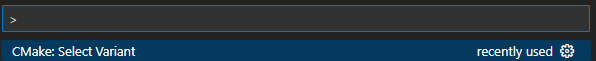
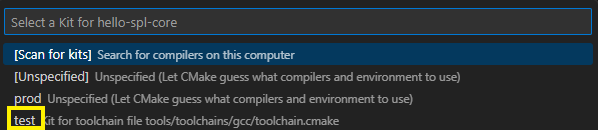

# Getting started with Software Product Line (SPL)

This guide will walk you through the process of setting up your SPL using the `spl-core` repository. Follow these steps  to get started.


## Clone the `spl-core` Repository 

First, clone the `spl-core` repository to your local machine using the following Git command:

```bash
git clone https://github.com/avengineers/spl-core 
```

This will create a local copy of the repository on your system.


## Follow the README.md

Once you've cloned the [spl-core](https://github.com/avengineers/spl-core) repository, proceed by following the instructions in the [README.md](https://github.com/avengineers/spl-core#readme) file to create your SPL project.


## Version Control(Optional):

It's highly recommended to manage your SPL project in a version control system, such as Bitbucket, GitHub, GitLab, or similar platforms.


## Install Necessary Tools

You need to install essential tools for your project. You can do this in either of the following ways:

Run the `install-mandatory.bat` file or use PowerShell and run `.\build.ps1 -install`.

After performing this step, please note that the Pipfile.lock will be updated with all the project dependencies.


## Customize a component

You can remove or reuse the component, which is created as an example. In this `hello-spl-core` we created `magical_number` as a component.

In order to link, build, generate documentation and test reports the architecture below is mandatory for your components:

`CMakeLists.txt`
    
    spl_add_source(src/magical_number.c)
    spl_create_component()

`src` folder contains the source code files.

`doc` folder contains the documentation in a restructured text file.

`test` folder contains the test code for the source code files.

Note: The cmake macros such as `spl_create_component()` and `spl_add_source()` are documented in `spl-core`.


## Customize a variant

In this `hello-spl-core` the variant is generated under the `variants\CustA\Var1` path.

`config.cmake` file sets cmake toolchain (do not modify this file).

`config.txt` file configures the variant features using KConfig.

`parts.cmake` file adds the needed components/modules/parts for the variant.

    spl_add_component(src/main)
    spl_add_component(src/magical_number)


## Write a test for a component

In this `hello-spl-core` the `magical_number` component needs to be tested. For this, the `Google Test` (GTest) framework available in `spl-core` is used.

For the name of the test the following convention is used:
[Google Test Docs](https://cuhkszlib-xiaoxing.readthedocs.io/en/latest/external/gtest/googletest/docs/FAQ.html#why-should-not-test-case-names-and-test-names-contain-underscore)

`test_magical_number.cc`

```C
/* include gtest header file */
#include <gtest/gtest.h>

/*  make all symbols from the testing namespace available in the current scope */
using namespace testing;

/* functions declared in this block have C-style */
extern "C"
{
#include "magical_number.h"
}

/* `TEST` is a macro provided by the GTest testing framework. The first parameter is `<Name of the Test Suite>` and the second parameter is `<Name of the Test Case>` */
TEST(magical_number, test_magical_number)
{
    /* use the assertion to verify the result */
    EXPECT_EQ(7, magical_number());
}
```

For every new test file, update the `CMakeLists.txt` file of the component by adding the test source file.

    spl_add_test_source(test/test_magical_number.cc)


## Build a variant

### Using Visual Studio Code (VS Code)

Install all the recommended extensions as shown below.


Select the variant you would like to build by using the shortcut "Ctrl+Shift+P".




Select the build kit you would like to build by using the shortcut "Ctrl+Shift+P".


Select the build target you would like to build by using the shortcut "Ctrl+Shift+P".


### Using PowerShell

```bash
.\build.ps1 -buildKit "prod" -variant "CustA/Var1"
```


## Build a test

### Using VS Code

Select the variant tests you would like to build by using the shortcut "Ctrl+Shift+P".


Select the build kit you would like to build by using the shortcut "Ctrl+Shift+P".




For all Tests of a variant, select the build target you would like to build by using the shortcut "Ctrl+Shift+P".


For all the tests of a specific component:


### Using PowerShell

For all tests of a variant:
```bash
.\build.ps1 -buildKit "test" -target "all"
```

For a specific component (src_component_name_unittests):

```bash
.\build.ps1 -buildKit "test" -target "src_magical_number_unittests"
```


## Build documentation

### Using VS Code

Select the variant you would like to build the documentation by using the shortcut "Ctrl+Shift+P".


For all docs (docs) of a variant or for a specific component (src_component_name_docs):


### Using PowerShell

For all docs of a variant:
```bash
.\build.ps1 -buildKit "test" -target "docs"
```

For a specific component (src_component_name_docs):
```bash
.\build.ps1 -buildKit "test" -target "src_magical_number_docs"
```

## Build reports

### Using VS Code

Select the variant you would like to build the reports by using the shortcut "Ctrl+Shift+P".


For all reports (reports) of a variant or for a specific component (src_component_name_reports):


### Using PowerShell

For all reports (reports) of a variant:
```bash
.\build.ps1 -buildKit "test" -target "reports"
```

For a specific component (src_component_name_reports):
```bash
.\build.ps1 -buildKit "test" -target "src_magical_number_reports"
```